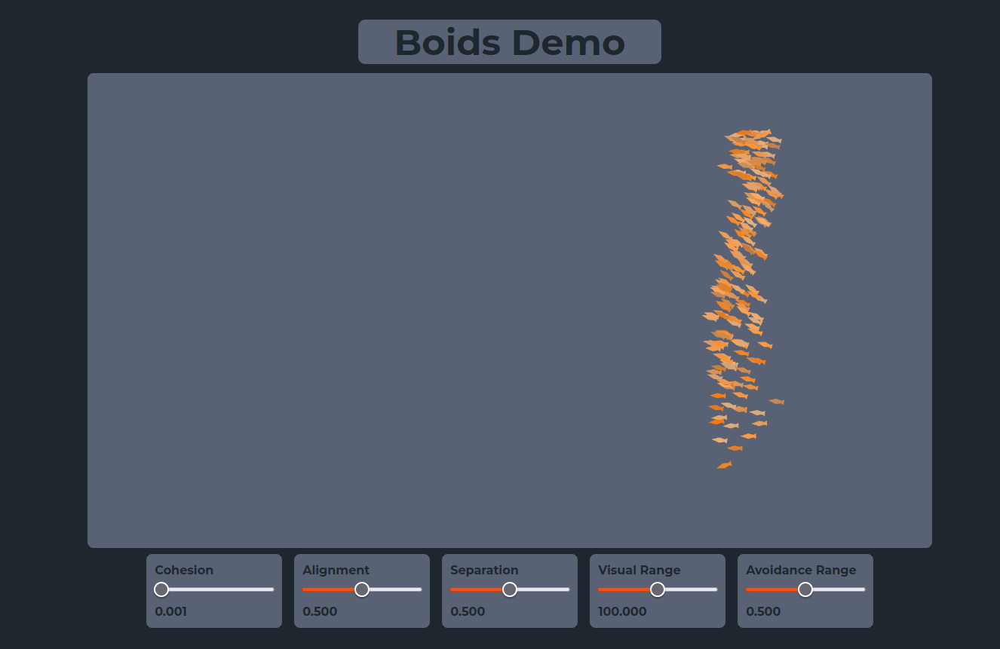

# Boids Demo

This is a small project that demonstrates a small simulations of the flocking behaviour of birds. In this case, it can also replicate the behaviour of schools of fishes.

You can visit the demo on this [site](https://jasatron9000.github.io/boids-demo)

## Built with
Programmed with **TypeScript** using the **React** framework. The simulation is a normal HTML5 Canvas element.

## Future Work
- Fix performance issues when changing the sliders.
- Fix performance issues when more than 300 boids are in the same time.

## References
- Used this [guide](https://people.ece.cornell.edu/land/courses/ece4760/labs/s2021/Boids/Boids.html) to help with my code
- More information [here](https://www.red3d.com/cwr/boids/)
- [Original Paper](https://www.red3d.com/cwr/papers/1987/boids.html)